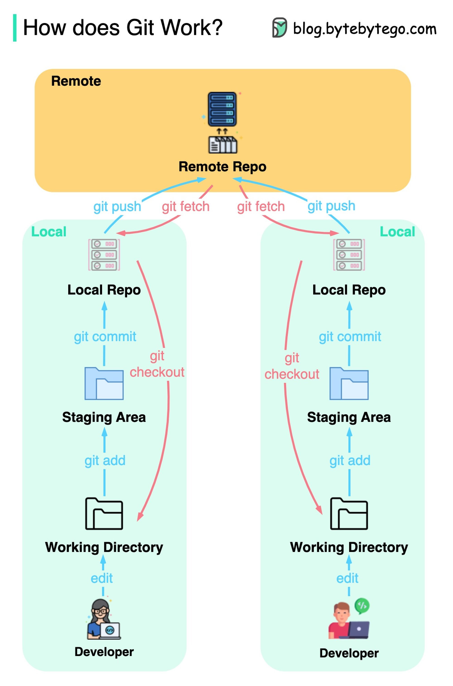

## Git and GitHub Tutorial

### Introduction

Git is a distributed version control system that allows developers to track changes in their code and collaborate with others efficiently. GitHub is a web-based platform that provides a user-friendly interface for hosting Git repositories and collaborating on projects. In this tutorial, we will walk you through the basics of Git and GitHub.

### Installing Git

Before you can start using Git, you need to install it on your computer. You can download Git from the official website by following this link: [Git Downloads](https://git-scm.com/downloads)

Once you have Git installed, you can open your command-line interface (e.g., Terminal on macOS/Linux or Git Bash on Windows) and begin configuring it.

### Configuring Git

Before you start using Git, you should configure your username and email address. This information is used to identify your commits.

Open your terminal and run the following commands, replacing `<Your Name>` and `<Your Email>` with your actual name and email address:

```bash
git config --global user.name "<Your Name>"
git config --global user.email "<Your Email>"
```

### Registering on GitHub

If you don't already have a GitHub account, you can create one by following these steps:

1. Open your web browser and go to [GitHub](https://github.com).
2. Click on the "Sign Up" button.
3. Follow the prompts to create your GitHub account, including selecting a username, entering your email address, and creating a password.

### Basic Git Commands

#### Initializing a Git Repository

To start tracking changes in a project folder, you need to initialize a Git repository. Navigate to your project directory in the terminal and run:

```bash
git init
```

#### Adding Files to the Staging Area

You can stage files for commit using the `git add` command. For example, to stage all files in your project directory, run:

```bash
git add .
```

#### Committing Changes

Once files are staged, you can commit them to the Git history:

```bash
git commit -m "Your commit message here"
```

#### Pushing Changes to GitHub

To upload your local commits to your GitHub repository, use the `git push` command:

```bash
git push origin master
```

#### Cloning a Repository

To clone a remote repository from GitHub to your local machine, use the `git clone` command:

```bash
git clone https://github.com/username/repository.git
```

#### Pulling Changes from GitHub

To retrieve the latest changes from a GitHub repository, use the `git pull` command:

```bash
git pull origin master
```

#### Creating and Switching Branches

Branches allow you to work on different features or fixes simultaneously. To create a new branch, use:

```bash
git branch branch-name
```

To switch to a different branch, use:

```bash
git checkout branch-name
```

#### Git workflow



#### Fixing Merge Conflicts

Merge conflicts occur when Git can't automatically merge changes from two different branches. To resolve conflicts, you'll need to manually edit the conflicting files and then commit the changes.

Remember, this is just the beginning of what Git and GitHub can do. These basic commands will get you started, but there's much more to learn as you become more comfortable with version control and collaboration. Happy coding!

## Real-Life Case Study: Collaborative Web Development with Git and GitHub

In this case study, we have two developers, Alice and Bob, who are collaborating on creating a landing page for a website. They are using Git and GitHub to manage their project. Let's walk through their workflow:

### Step 1: Initializing the Project

1. **Alice** creates a new GitHub repository called "landing-page" on her GitHub account.

2. She then clones the empty repository to her local machine:

   ```bash
   git clone https://github.com/alice/landing-page.git
   ```

3. **Bob** also wants to contribute to the project, so he clones the same repository to his local machine:

   ```bash
   git clone https://github.com/alice/landing-page.git
   ```

### Step 2: Dividing the Work

Alice and Bob decide to divide the work to avoid conflicts. They agree on the following tasks:

- **Alice**: She will work on the header section, creating `header.html` and `style.css`.
- **Bob**: He will work on the main content section, creating `main.html` and `style.css`.

### Step 3: Working on Separate Branches

Both Alice and Bob create their own branches to work on their respective tasks.

**Alice**:

```bash
cd landing-page
git checkout -b alice-header
```

**Bob**:

```bash
cd landing-page
git checkout -b bob-main-content
```

### Step 4: Developing and Committing

#### Alice's Workflow

Alice edits `header.html` and `style.css`, adds and commits her changes:

```bash
# Make changes to header.html and style.css
git add header.html style.css
git commit -m "Added header section"
```

#### Bob's Workflow

Bob edits `main.html` and `style.css`, adds and commits his changes:

```bash
# Make changes to main.html and style.css
git add main.html style.css
git commit -m "Added main content section"
```

### Step 5: Pushing to GitHub

Now, Alice and Bob push their changes to the GitHub repository:

**Alice**:

```bash
git push origin alice-header
```

**Bob**:

```bash
git push origin bob-main-content
```

### Step 6: Creating Pull Requests

Alice and Bob go to the GitHub repository's page and create pull requests for their branches. They describe their changes and submit the pull requests.

### Step 7: Merging without Conflicts

Since Alice and Bob worked on separate files and in separate branches, there are no conflicts. The pull requests are reviewed and approved.

### Step 8: Merging and Updating

After their pull requests are approved, Alice and Bob can merge their changes into the `master` branch:

**Alice**:

```bash
# Switch to the master branch
git checkout master

# Merge the changes from alice-header branch
git merge alice-header

# Push the changes to GitHub
git push origin master
```

**Bob**:

```bash
# Switch to the master branch
git checkout master

# Merge the changes from bob-main-content branch
git merge bob-main-content

# Push the changes to GitHub
git push origin master
```

### Conclusion

Alice and Bob successfully collaborated on creating a landing page without any conflicts by following good Git practices. They used branches to isolate their work, created pull requests for review, and merged their changes into the `master` branch. This workflow allowed them to work seamlessly on different parts of the project.

## Real-Life Case Study: Resolving Merge Conflict in a Collaborative Git Project

In this scenario, we have Alice and Bob again, but this time they both attempt to work on the same file, `index.html`, causing a merge conflict when they try to push their changes to the GitHub repository. Let's see how they can resolve this conflict:

### Step 1: Initializing the Project

1. **Alice** and **Bob** start with the same initial setup as in the previous scenario. They have cloned the GitHub repository for the landing page and are ready to start working.

### Step 2: Unplanned Collaboration

Unfortunately, Alice and Bob both started working on the `index.html` file without realizing the other was also making changes. They each make different changes to the same section of the file:

**Alice** makes the following changes to `index.html`:

```html
<!-- Alice's Changes -->
<div id="header">
  <h1>Welcome to Our Website</h1>
</div>
```

**Bob** makes these changes:

```html
<!-- Bob's Changes -->
<div id="header">
  <h1>Visit Our Amazing Website</h1>
</div>
```

### Step 3: Committing Changes

Both Alice and Bob commit their changes to their respective branches:

**Alice**:

```bash
git add index.html
git commit -m "Alice's changes to header"
git push origin alice-header
```

**Bob**:

```bash
git add index.html
git commit -m "Bob's changes to header"
git push origin bob-main-content
```

### Step 4: Merge Conflict Arises

When Alice tries to merge her branch into the `master` branch, she encounters a conflict:

```bash
git checkout master
git merge alice-header
```

The terminal shows a conflict message:

```
Auto-merging index.html
CONFLICT (content): Merge conflict in index.html
Automatic merge failed; fix conflicts and then commit the result.
```

### Step 5: Resolving the Conflict

To resolve the conflict, Alice and Bob need to open the `index.html` file and manually choose which changes to keep. The conflicted section might look something like this:

```html
<div id="header">
  <<<<<<< HEAD
  <h1>Welcome to Our Website</h1>
  =======
  <h1>Visit Our Amazing Website</h1>
  >>>>>>> alice-header
</div>
```

- The `<<<<<<< HEAD` marker indicates Alice's changes.
- The `=======` marker separates the conflicting changes.
- The `>>>>>>> alice-header` marker indicates Bob's changes.

Alice and Bob need to decide how they want the final version to look. Let's say they agree to keep Bob's version:

```html
<div id="header">
  <h1>Visit Our Amazing Website</h1>
</div>
```

### Step 6: Committing the Resolution

After resolving the conflict, Alice needs to commit the changes:

```bash
git add index.html
git commit -m "Resolved conflict by keeping Bob's version"
```

### Step 7: Pushing the Resolution

Now that the conflict is resolved, Alice can push the changes to the `master` branch:

```bash
git push origin master
```

### Conclusion

Alice and Bob successfully resolved the merge conflict by manually editing the conflicted file and choosing which changes to keep. This scenario demonstrates the importance of communication and coordination when working on the same files in a collaborative Git project. It's crucial to be aware of potential conflicts and resolve them promptly to maintain a smooth workflow.
